# VFX Project 1: High Dynamic Range Imaging

## 作者

- 電機三 趙崇皓 B06901104
- 電機三 黃彥翔 B06901170

## 檔案架構

- `run.sh`：在裡面定義一些 argument 來跑 `main.py`。
- `main.py`：會 `import lib.hdr` 來執行程式，並處理 command line arguments
- `lib`：自己的函式庫
  - `hdr.py`：處理 Debevec's Methods 的一些函式，例如解線性系統等等
  - `hat_functions.py`：定義 Debevec's Method 裡面不同的 hat functions

## 執行方式

主程式是 main.py，可以直接 python3 main.py 或是跑 run.sh。有一些 argument 可以使用者自訂。

|  Argument  |                         Explanation                          | Required |
| :--------: | :----------------------------------------------------------: | :------: |
| input_dir  |                 存不同 exposure 影像的資料夾                 |   Yes    |
| output_dir |               存輸出 .hdr 檔和 plots 的資料夾                |   Yes    |
|     l      |            Debevec's Method 裡面的 lambda factor             | Optional |
|   scale    | Downsample factor （有些照片太大會跑比較久，可以先縮小照片） | Optional |
|    hat     |          Debevec's Method 裡面的 weighting function          | Optional |
|   align    |          是否要使用 alignment algorithm（advised）           | Optional |
有其他疑問可以執行` python3 main.py --help`。

## 演算法

我們實作了上課提到的 Debevec's Method。

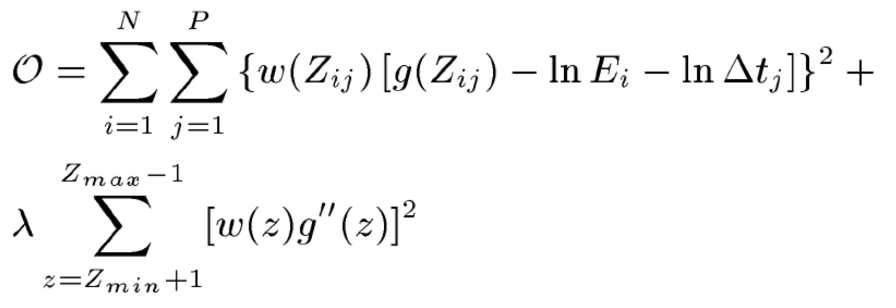

由上述 objective function 解出 g 這個 mapping function 以後，就可以用下面公式算出一個 color channel 中每一個 pixel 的 radiance，也就是得到該 channel 的 radiance map。把不同 channel 的 radiance map 組合起來就可以得到最終的 hdr image。

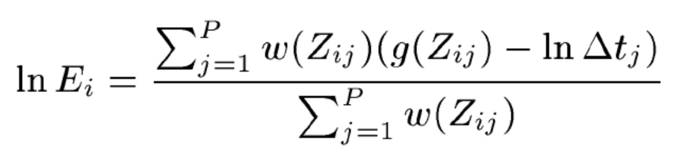

## 說明

我們大概拍了 9 張照片，其中 exposure 是每張照片兩倍的遞增。拿到 jpg 檔以後可以用 `PIL` 裡面的含式去讀 jpg 檔的 metadata 拿到 exposure （ see `lib.hdr.get_labeled_exif`）。這是 Debevec's Method 裡面的 delta t。

針對每一個 color channel（也就是接下來的步驟要總共做三次），要去 sample 圖中的一些點的 pixel value。我們最後是直接等距 sample 一些點，但試過 random sampling 其實效果也差不多。Sample 完點以後就是把值傳入 `lib.hdr.solve_debevec` 來解出 g 這個 mapping function（是一個 256 維的陣列，0~255 的 index 分別代表 該 pixel value 對應到的 irradiance 值）。

接者就可以用 g 來算不同 channel 的 radiance map。我們利用一些 numpy 中 vectorized 的函式（例如下面程式碼中的 `np.average`，可以加快速度：

```python
def get_radiance_map(images, g, exp, w):
    _h, _w = images[0].shape
    images = np.array(images)
    E = []
    for i, img in enumerate(images):
        E.append(g[img] - exp[i])
    rad = np.average(E, axis=0, weights=w[images])
    return rad
```

把三個 channel 的 radiance map 組合起來就可以得到最終的 hdr image。注意最後是用 `np.float32` 的資料型態來儲存。

最後我們利用開源的 Luminance HDR 套件來 tone map 我們的 hdr image，選用的演算法是 Mantuik '06。

## 結果

下面是我們拍攝的不同曝光時間的照片。

|  |  |  |
| ------------------------------------- | ------------------------------------- | ------------------------------------- |
|  |  |  |
|  |  |  |

我們選用的參數是 lambda = 20，然後 weighting function 就是 linear（就是論文中提到的函式，後面會跟我們自己寫的 sin, guassian weighting 函式作比較）。

最終得到的不同 channel 的 mapping function g，可以看到幾乎是完全吻合，解出了同一個 g：

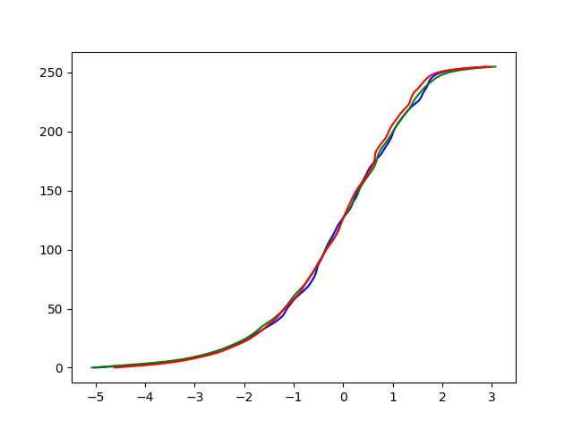

Tone mapped 的影像：


## 實驗

### 使用不同 Weighting Function

在 `lib.hat_functions` 中我們定義了一些對於 0 - 255 pixel 值的 weighting function，圖示如下：

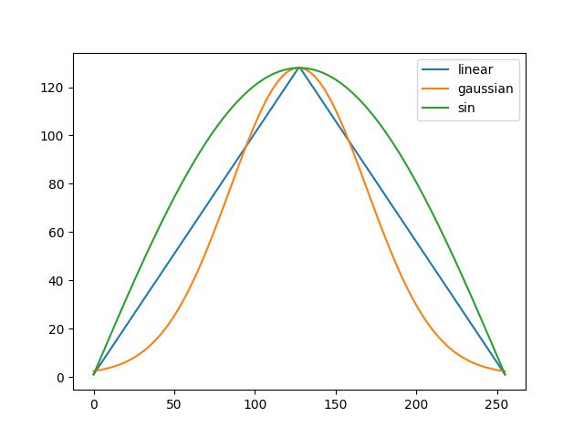

實驗中，我們固定 lambda = 20，並使用 Mantuik '06 的演算法來 tone mapping，觀察 weighting function 對最終結果的影響，並把沒有 weighting 的當成對照組。

|          | g                                          | Tone mapped                              |
| -------- | ------------------------------------------ | ---------------------------------------- |
| None     | 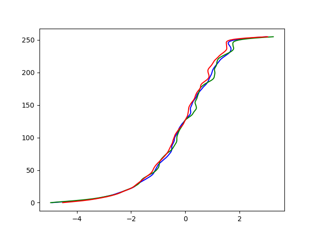     | 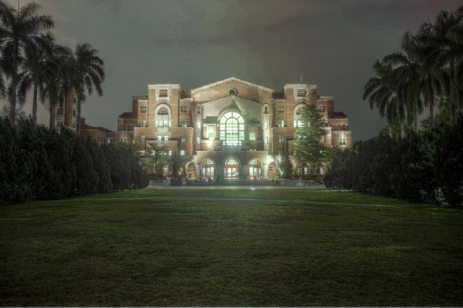     |
| Linear   | 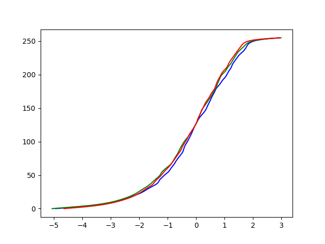   | 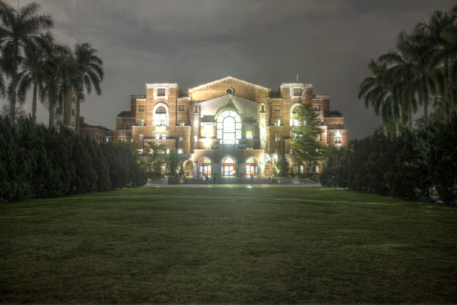   |
| Gaussian | 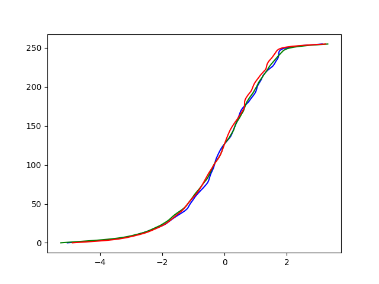 |  |
| Sin      | 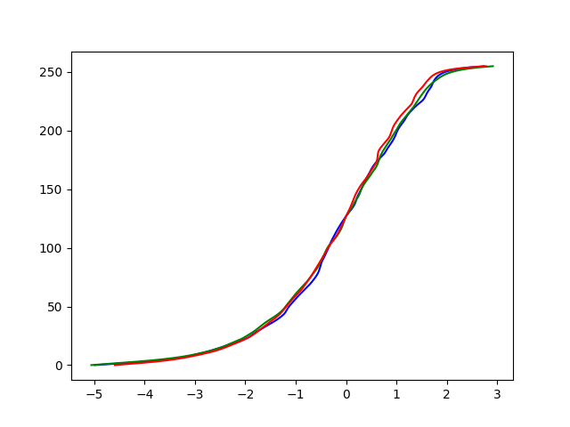      |       |

其實結果並沒有差非常多。

###  使用不同 Lambda

我們嘗試使用不同的 lambda 來看看 objective 中平滑項和另一項的 tradeoff 關係。實驗中我們固定 weighting function 是 linear，並使用 Mantuik '06 來 tone map。

| Lambda | g                                        | Tone mapped                            |
| ------ | ---------------------------------------- | -------------------------------------- |
| 1      | 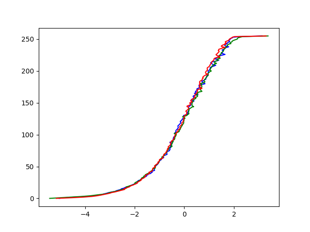  |   |
| 2      | 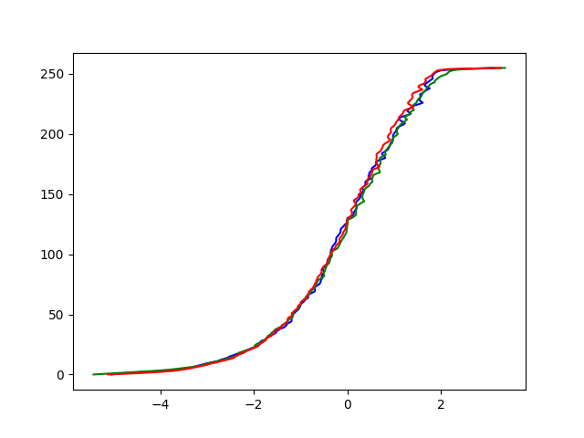  |   |
| 5      | 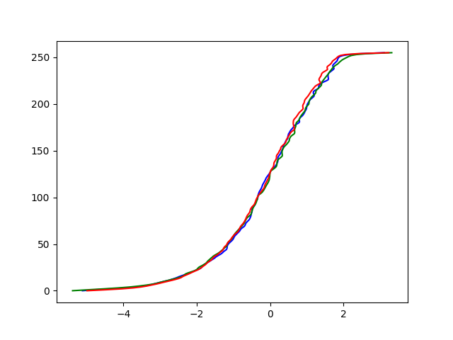  |   |
| 10     | 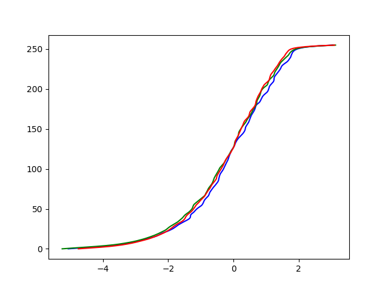 |  |
| 20     |  |  |
| 50     | 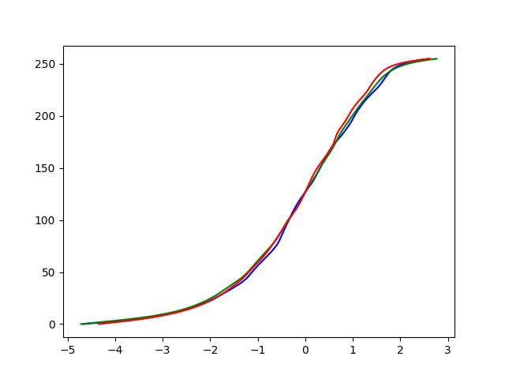 |  |

從上面的比較可以看出隨著 lambda 的增大，平滑項的影響也越來越大，因此曲線確實有越來越平滑。至於 tone mapped 以後的結果並無顯著的差別（但仔細觀察會發現 lambda 約大其實影像細節有比較清楚）。

### 使用 Alignment

我們也有另外時做了 MTB Alignment Algorithm，程式碼在 `lib.alignment`。下圖比較有無 alignment 的差別（我們固定 weight function 為 linear，lambda = 20）。  
我們實作Alignment的方法為MTB。首先我們先選定一張照片，以作為alignment的參考，這裡我們選定第五張照片，因為曝光太多或是太少的照片都會讓細節變得較少，不適合作為參考圖。  
選定照片之後，對於每一張照片，都套用MTB的方法來對齊照片。首先利用cv2中的resize功能，將要對齊的照片以及參考圖皆壓縮6倍（倍數可以調整），並將其轉會為bitmap，並搜尋其9個neighbors何者與參考圖的difference最小，並記錄下來。之後再將要對齊的照片壓縮5倍，並shift到上一層（壓縮6倍）時的最小difference位置，然後再搜尋其9個neighbors。重複至壓縮1倍（也就是沒有壓縮），並輸出shift過後的圖片。
這個方法的缺點是一但有一個level做錯，則後面就無法再shift回最佳的對齊位置了，且當圖片壓縮得越嚴重，則越有可能會shift錯位置，因此建議最大的壓縮倍數不要調得太高。

|                | Result                                            |
| -------------- | ------------------------------------------------- |
| No Alignment   | 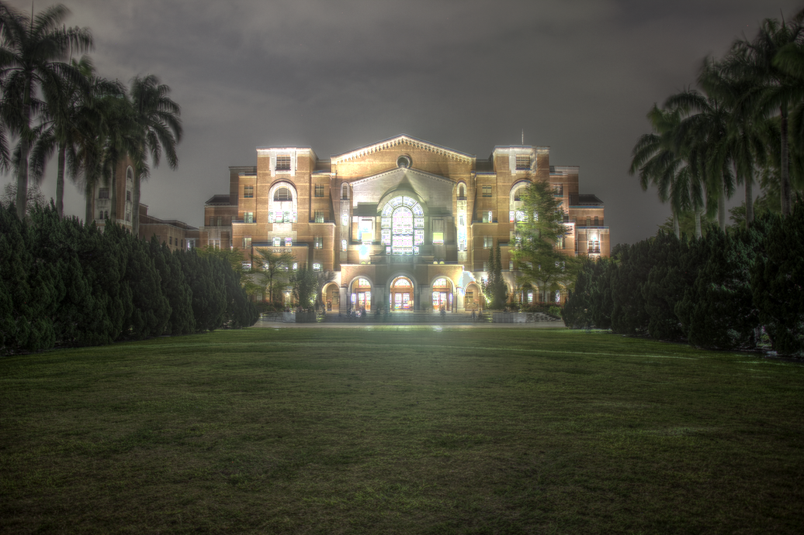 |
| With Alignment |     |

 